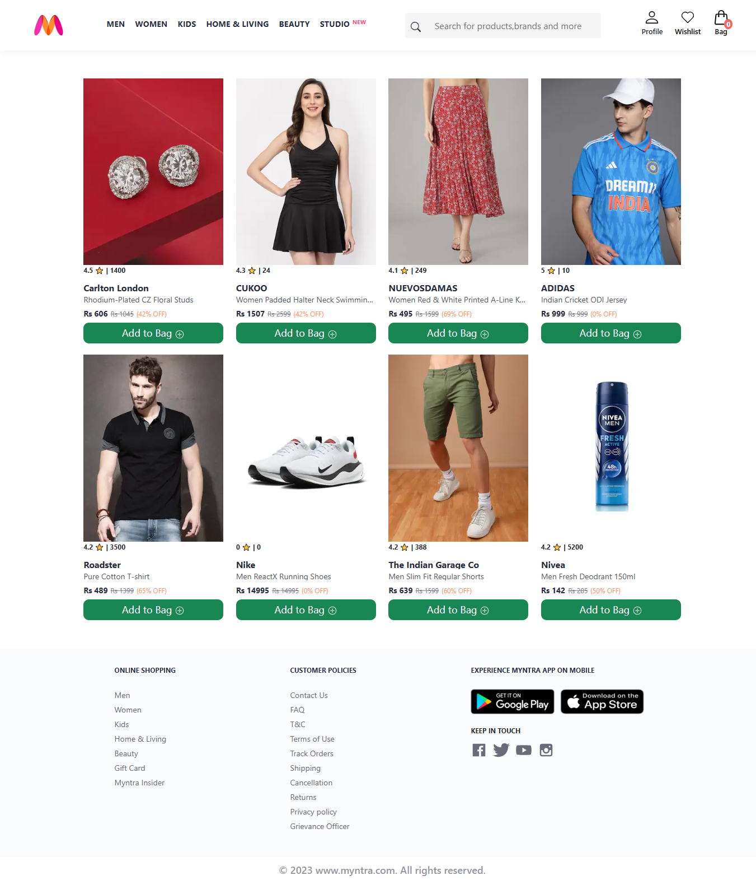
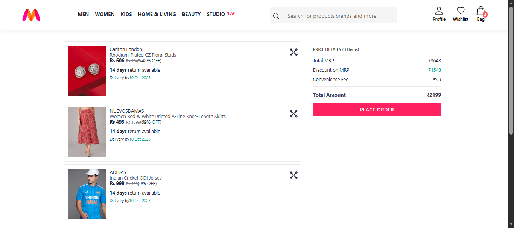

# 🛍️ Myntra Clone (React.js + Node.js)

A functional Myntra Clone built using **React.js** and **Node.js**, featuring a **responsive homepage**, **product listing**, and a **working cart/bag system** with price calculations and order summary.

---

## ✨ Features

### 🖥️ Frontend (React.js)

✔ Fully responsive Home Page

✔ Product listings with image, price, rating, and discount

✔ Product details fetched from local JSON / API

✔ Working **Add to Bag**, **Remove from Bag**, and **Cart Count Update**

✔ Dynamic Cart Page with:

- Quantity update
- Price details
- Discount calculation
- Total amount calculation

✔ Navbar with Menus, Search Bar, Profile, Wishlist & Bag icons

✔ Clean and modern UI inspired by Myntra

✔ Routing with React Router

---

### 🚀 Backend

✔ API to serve product data

✔ API routes: `/products`, `/cart`

✔ Simple in-memory / JSON-based cart (optional)

✔ Can be later extended to MongoDB / Firebase / MySQL

---

## 🛠️ Tech Stack

| Part             | Technology                     |
| ---------------- | ------------------------------ |
| Frontend         | React.js, React Router, CSS    |
| Backend          | Node.js, Express.js            |
| State Management | Context API / Redux (optional) |

---

## 🛒 Cart Feature Screenshots

### 🏠 Home Page



---

### 🛍️ Cart / Bag Page



---

## ⚙️ Installation & Setup

### 📥 1. Clone the Repository

```bash
git clone https://github.com/FaiqaN27/myntra-clone
cd myntra-clone
```

---

### ⚛ 2. Install Frontend Packages

```bash
cd Myntra_Fronted
npm install
npm run dev
```

---

### 🌐 3. Install Backend

```bash
cd Node_Backend
npm install
npm start
```

---

## 🔄 How Cart Works

| Action          | Functionality                                |
| --------------- | -------------------------------------------- |
| Add to Bag      | Adds product to cart and updates badge count |
| Remove from Bag | Deletes product from cart                    |
| Price Summary   | Calculates MRP, Discount, Final Amount       |
| Cart Count      | Updates dynamically in Navbar                |

---

## 🤝 Contributing

Pull requests and suggestions are welcome!
Feel free to fork, enhance, and contribute 🚀

---

## 📄 License

This project is for **educational and demonstration purposes only**, not for commercial use.

---

## ❤️ Credits

Inspired by **Myntra.com**
Built with React.js, Node.js, and love 💖

---
